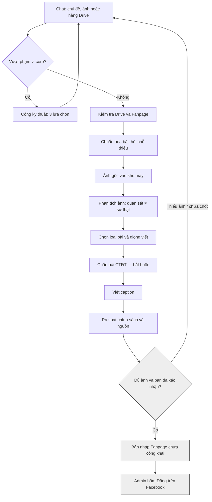
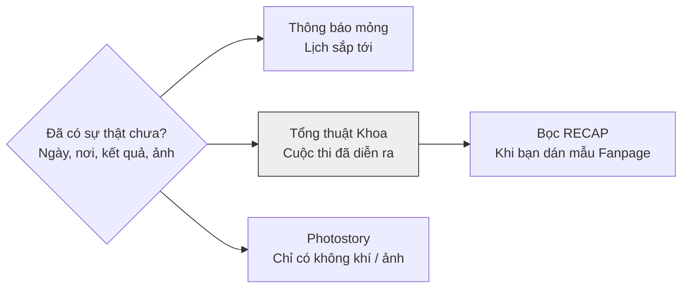
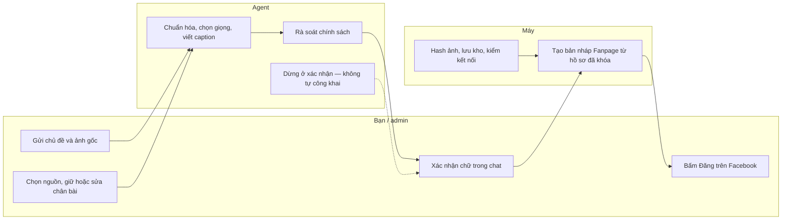

# Sơ đồ pipeline Fanpage Khoa Kinh tế HVNH

File này là bản xem được trên OpenCode, GitHub, và mọi trình xem Markdown có Mermaid. Canvas Cursor vẫn nằm ngoài repo; đây là bản portable cùng nội dung.

Đường mặc định: sau khi bạn xác nhận và đủ ảnh, hệ thống tạo **bản nháp Fanpage chưa công khai**. Chat không làm bài thành công khai. Admin bấm Đăng trên Facebook mới là quyết định cuối.

## 1. Luồng tạo một bài

Sửa chữ hoặc đổi ảnh: tạo phiên bản mới. Bản nháp cũ không còn khớp; phải xác nhận lại rồi mới tạo nháp mới.

Đường phụ (chỉ khi tắt chế độ nháp Fanpage): mở trang duyệt trên máy, người bấm nút ký duyệt, rồi máy đăng bài đã duyệt. Agent không viết quyết định duyệt hộ.

## 2. Nhánh giọng viết

Xương sống là sự thật hoặc ảnh. Giọng viết là cách kể. Không trộn thông báo lịch với tổng kết cuộc thi.

| Giọng | Dùng khi | Văn phong |
| --- | --- | --- |
| Thông báo mỏng | Lịch, tọa đàm sắp tới | Thời điểm + ai + việc gì. Gọn, gần website thông báo. Khoảng 120–220 từ. Ít hoặc không emoji. |
| Tổng thuật Khoa | Công bố kết quả, đêm chung kết, đội thắng | Học nhịp bài EC / PMC / I-impACT trên website Khoa, nén 220–400 từ. Kết quả viết thành câu: *danh hiệu Quán quân gọi tên…*. Giữ động từ nguồn (*hướng đến việc giúp, cọ xát, rèn*). Không điện tín, không “đưa sinh viên vào…”. |
| Bọc RECAP | Bạn dán mẫu Fanpage `[ RECAP ]` | Cùng xương tổng thuật Khoa; giữ kicker và emoji đầu đoạn. |
| Photostory | Chưa có bảng giải / diễn biến, chỉ còn không khí | Mở bằng cảnh nhìn thấy. Ảnh không bịa thành kết quả. |

Bài website Khoa cùng sự việc thì dài hơn, có tiêu đề, không emoji. Facebook không đổ nguyên bài web.

## 3. Ai được làm gì

| Việc | Agent | Bạn / admin | Máy |
| --- | --- | --- | --- |
| Chọn loại bài và viết caption | Có | Sửa / xác nhận | Không |
| Copy ảnh, hash, lưu kho | Không | Gửi ảnh gốc | Có |
| Bịa ngày, giải, nhà tài trợ | Cấm | Cung cấp nguồn | Cấm |
| Tạo bản nháp Fanpage | Gọi sau khi bạn chốt | Xác nhận chữ | Upload ảnh + caption đã khóa |
| Làm bài công khai | Cấm | Bấm Đăng trên Facebook | Chỉ khi tắt chế độ nháp và đã duyệt ký |
| Sửa file duyệt hộ | Cấm | Không cần | Chỉ trang duyệt local (đường phụ) |

Nguồn vào trước khi viết: chat thô, Google Drive (kế hoạch + ảnh), website Khoa (hit bạn chọn), giọng Fanpage gần đây. Hit không chọn thì không vào caption.

## Xem file này

- **Trình duyệt (sơ đồ chắc chắn hiện):** mở `docs/pipeline-diagram.html`.
- **OpenCode:** mở được `docs/pipeline-diagram.md` như file thường. App/desktop: tab file có thể có Preview (Mermaid nếu bản đó hỗ trợ). CLI/TUI: thường hiện chữ Markdown, không vẽ sơ đồ — dùng file HTML.
- **Canvas Cursor** (bản tương tác, không dùng được trong OpenCode): mở cạnh chat trong Cursor.
